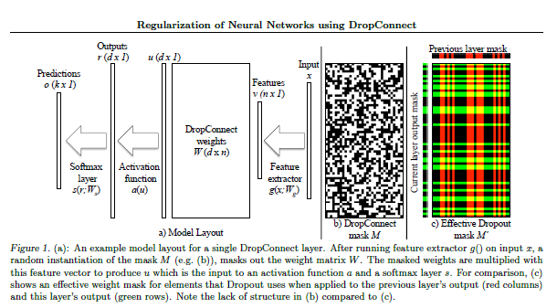

# Neural Language Modelling

By: [Vineet Kumar Singh](https://www.twitter.com/viiitdmj)

How do i make this https://www.youtube.com/watch?v=VnFC-s2nOtI


[Training RNNS SMerity Slides](https://docs.google.com/presentation/d/1JbF9CgMDQrOHlR8BKO5zX3ykZsZ3ezFUEjwAsaO_NDc/edit#slide=id.p)

[Visualize Attention in RNNS](https://medium.com/datalogue/attention-in-keras-1892773a4f22)

[This Twitter Thread](https://twitter.com/jeremyphoward/status/1011249558586720256)

[Natural Language Decalathon: Salesforce](https://einstein.ai/research/the-natural-language-decathlon)

**[Current SOTA](https://github.com/sebastianruder/NLP-progress/blob/master/language_modeling.md):  **[Breaking the Softmax Bottleneck: A High-Rank RNN Language Model
](https://arxiv.org/pdf/1711.03953.pdf)

[Super Convergence for wikitext2](http://forums.fast.ai/t/super-convergence-ish-on-wikitext-2/17091?u=visingh)


[How to use use_clr_beta](http://forums.fast.ai/t/using-use-clr-beta-and-new-plotting-tools/14702)


[Training Phase API](http://forums.fast.ai/t/new-training-schedule-api-in-fastai/15053)


[Callback system in fastai](http://forums.fast.ai/t/using-the-callback-system-in-fastai/16216)

[use_clr](http://forums.fast.ai/t/understanding-use-clr/13969)

[Discussion on lrf for wikitext](http://forums.fast.ai/t/how-do-i-interpret-this-lr-graph-wikitext103/18171/5)

Validate: ```As for the 1cycle, it’s use_clr_beta you should use, and (50,15,0.95,0.85) doesn’t seem weird to me for an argument.```

http://forums.fast.ai/t/the-1cycle-policy-an-experiment-that-investigate-super-convergence-phenomenon-described-in-leslie-smiths-research/14737


https://github.com/letsdodatascience/Deep-Learning


*[Understanding the Mixture of Softmaxes (MoS)](https://smerity.com/articles/2017/mixture_of_softmaxes.html) to understand SOTA*

*Follow up reading: *[Sigsoftmax: Reanalysis of the Softmax Bottleneck](https://arxiv.org/pdf/1805.10829.pdf)

**Read This: **[On the importance of initiliation and momentum in deep learning](http://www.cs.toronto.edu/~fritz/absps/momentum.pdf)

*Language Modelling dataset: * [wiki-text2 and wikitext-103](https://einstein.ai/research/the-wikitext-long-term-dependency-language-modeling-dataset)


*[Easy Latex Draw](http://detexify.kirelabs.org/classify.html)* 

**Read This: **[Optimizations in 2017](http://ruder.io/deep-learning-optimization-2017/)

*little experiment idea*: [Neural Spell Checkers](http://forums.fast.ai/t/nlp-any-libraries-dictionaries-out-there-for-fixing-common-spelling-errors/16411)

*AWD-LSTM and Neural Cache are recent SOTA in language modelling task* The [AWD-LSTM paper](https://github.com/salesforce/awd-lstm-lm) seems to be written well, and uses a bunch of cool tricks from prior publications. We will understand each of those tricks in detal and then move onto 
[An Analysis of Neural Language Modeling at Multiple Scales](https://arxiv.org/pdf/1803.08240.pdf), [Improving neural language models with continuous cache](https://arxiv.org/pdf/1612.04426.pdf) and [Quasi-Recurrent Neural Networks: QRNN's](https://arxiv.org/pdf/1611.01576.pdf).

```Architecture```: Three-layered LSTM model with 1150 units in the hidden state and an embedding size of 400.

- ```Attention Material```
    - [Colin Raffel - Doing Strange Things with Attention](https://www.youtube.com/watch?v=YtHjmm9Cx3s)
    - [Attention and Memory in Deep Learning Networks](https://www.youtube.com/watch?v=uuPZFWJ-4bE&t=1261s9)
    - [Original Atention Paper](https://arxiv.org/abs/1409.0473)
    - [Google's NMT](https://arxiv.org/abs/1609.08144v2)

## Neural language model regularization techniques 

### 1. Weight-dropped LSTM (DropConnect)
  - [Regularization of Neural Networks using DropConnect](https://cs.nyu.edu/~wanli/dropc/dropc.pdf)
  - Instead of setting randomly selected subset of activations to zero, set a randomly selected subset of weights within a network to zero. 
  

  
### 2. NT-ASGD 
### 3. Extendend regularization techniques 
- Variable length backpropogation sequences 
    - [SortSampler](https://github.com/fastai/fastai/blob/master/fastai/text.py#L118)
    - [SortishSampler](https://github.com/fastai/fastai/blob/master/fastai/text.py#L125)
    - ```bptt = self.bptt if np.random.random() < 0.95 else self.bptt / 2```.
    - ```seq_len = max(5, int(np.random.normal(bptt, 5)))```
- Variational dropout 
    - ```Locked Dropout```
- Embedding dropout 
    - [RNN Dropout](https://medium.com/@bingobee01/a-review-of-dropout-as-applied-to-rnns-part-2-4e35ba3a4360)
    - [Part 1](https://medium.com/@bingobee01/a-review-of-dropout-as-applied-to-rnns-72e79ecd5b7b)
- Weight tying 
    - [Tying word vectors and word classifiers: A loss framework for language modelling](https://arxiv.org/pdf/1611.01462.pdf)
    - [Using the Output Embedding to Improve Language Models](https://arxiv.org/pdf/1608.05859.pdf)
    - [Attention blog: maybe good](https://towardsdatascience.com/memory-attention-sequences-37456d271992)
    - [Using QRNN in Language Models](http://forums.fast.ai/t/using-qrnn-in-language-models/17278)
- Independent embedding size and hidden size 
- Activation Regulatization (AR) and Temporal Activation Regulaization (TAR)

## Continous Cache Pointers 
[Pointer Cache Models](https://sgugger.github.io/pointer-cache-for-language-model.html#pointer-cache-for-language-model)
- The neural cache model (Grave et al., 2016) can be added on top of a pre-trained language model at negligible cost. The neural cache stores the previous hidden states in memory cells and then uses a simple convex combination of the probability distributions suggested by the cache and the language model for prediction. The cache model has three hyperparameters: the memory size (window) for the cache, the coefficient of the combination (which determines how the two distributions are mixed), and the flatness of the cache distribution. All of these are tuned on the validation set once a trained language model has been obtained and require no training by themselves, making it quite inexpensive to use. 


### 4. ULMFIT

[Universal Language Model Fine-tuning for Text Classification
](https://arxiv.org/pdf/1801.06146.pdf)

### 5. Open AI Transformers

[Improving Language Understanding with Unsupevised Learning](https://s3-us-west-2.amazonaws.com/openai-assets/research-covers/language-unsupervised/language_understanding_paper.pdf)

### 6. ELMO and GLOMO Allen AI

[ELMO: Deep contextualized word representations](Deep contextualized word representations)

## Understand Sequence Labelling Task for NLP
- [Sample Repo Link](https://t.co/05ZL6bEcoO)


```===========================================================================================```
Hello World 

### Dataset

### Architecture 

### Loss 

```===========================================================================================```

[Dynamic Evaluation of Neural Sequence Models](https://arxiv.org/abs/1709.07432)

[Breaking the Softmax Bottleneck: A High-Rank RNN Language Model](https://arxiv.org/abs/1711.03953)

[Zipf's Law](https://simple.wikipedia.org/wiki/Zipf%27s_law)
